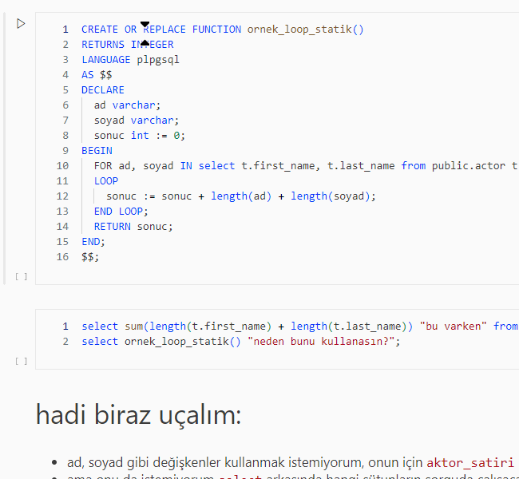
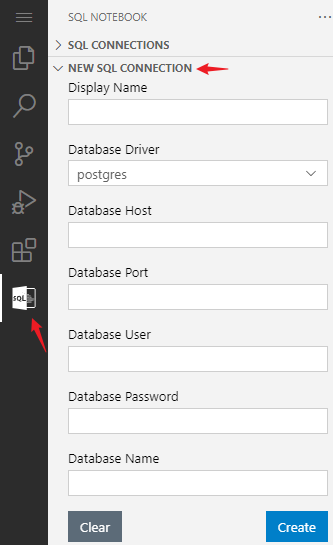
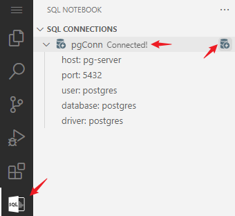
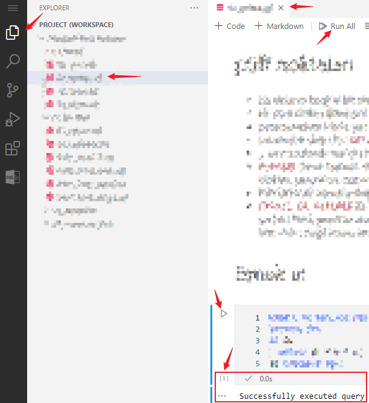

# nedir?

sadece [Docker](https://docker.com/) ve (modern) bir tarayıcı ile [Notebook](https://jupyter.org/) kolaylığında kurcalarken Postgres (PG lakabıyla andık çok yerde) öğrenme şeysi: [Coder](https://coder.com/docs/code-server/latest) üzerinde [Sql Notebook](https://github.com/cmoog/vscode-sql-notebook) eklentisiyle [Pagila](https://github.com/devrimgunduz/pagila) veri tabanına bağlanıp mevcut notları okurken çalıştırabilir, çalıştırırken kurcalayabilirsin!

## nasıl?
1. bu repoyu klonlayın, klonladığınız klasörde;
1. `docker compose up` komutunu çalıştırın (9615 portu kullanımda ise [buradan](./docker-compose.yml) ve [buradan](./coder/config.yaml) değiştirilebilir).
1. docker gerekli imajları hazırladıktan sonra (biraz zaman alabilir) tarayıcıdan http://localhost:9615 adresine gidin.
1. parola alanına __postgres__ girip devam edin.
1. Sql Notebook eklentisinin _New Sql Connection_ kısmına aşağıdaki bilgileri girin ve _Create_ komutunu çalıştırın.
   |ayar|değer|açıklama|
   |---|---|---|
   |Display Name|pgConn |ya da dilediğin bir isim|
   |DB Driver|postgres|
   |DB Host|pg-server|
   |DB Port|5432|
   |DB User|postgres|
   |DB Password||detayı aşağıda yazıyor|
   |DB Name|postgres|
   
   
1. bağlantıyı aktif edin: (sorun yoksa _Connected_ ifadesi belirir, bunu görmeden paçaları sıvamayın!)
   
1. _Explorer_'daki dosyaları kurcaklamaya başlayın (sırayla gitmekte fayda var):

   

## bunları bilsen iyi olur
- Sql Notebook eklentisi [henüz](https://github.com/cmoog/vscode-sql-notebook/issues/65) ayarları kaydetmediği için tarayıcıyı kapattığında parolayı kaybedecek. eklentinin sadece parolayı mevcut tanıma eklemek gibi bir yeteneği de şu an olmadığı için PG'ye parola olmadan bağlanıyoruz. evet yanlış bir kullanım fakat eklentinin kısıtlarının _öğrenme_ konusunun önüne geçmemesi için böyle bir tercih yaptım. isteyen [_compose_](./docker-compose.yml) dosyasından değiştirebilir.
- bu arada yukarıda bahsettiğimiz konunun bir uzantısı olarak eklenti tarayıcıyı kullanma tarzına (cookie ayarları, her kapandığında geçmişi temizle vb.)  göre 2 farklı oturum arasında tüm ayarları da kaybedebilir. eklenti normalde kurulu bir uygulama üzerinde çalışmayı umuyor, biz farklı bir şekilde kullanıyoruz.
- Notebook yapısına biraz vakıf olmakta fayda var: bir hücre kendinden önceki hücredeki bir öğeye atıfta bulunuyorsa bu _öncül_ çalışmadan _ardıl_ çalıştığında hata verecektir.
- Docker _volume_ yapısı da önemli: örnekler ortamı bulduğu gibi bırakmaya çalışsa da veri tabanında kalmasını istediğin bir değişiklik ilgili _volume_'e bağlı.
- tarayıcı içinde çalışan editör dışarıdaki klasörde `.git` olduğundan habersiz.
- _container_'lar _unless-stopped_ şeklinde çalışıyor; cihazında kaynak sorunu varsa işin bitince (_container_/_volume_ ne kadarına ihtiyacın yoksa) temizlemek faydalı olabilir.
## sorumluluğun reddi:
burada göreceğin örnekler, adı üstünde **örnek**. olabildiğince çeşitliliği artırıp mümkün mertebe tezat yaparak birkaç nöronu rahatsız etme niyetindeyim. "şunu alıp _mühim_ bir yerde çalıştırdım ahanda şöyle patladı"; "yok sen böyle dedin ama şöyleymiş" gibi başı-sonu hüsran muhabbetlerle birbirimizi üzmeyelim. benim yazdıklarımla hayatını ciddi şekilde etkileyecek işler yapma niyetindeysen bi' ara görüşelim: acayip yatırım fikirlerim var!
